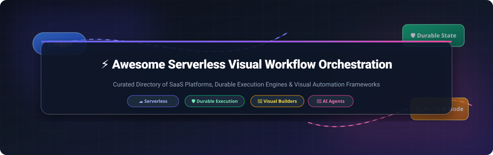

# ⚡ Awesome Serverless Visual Workflow Orchestration 🚀

  

  
  
  
  
  
  

---

## 💡 About This Repository

Welcome to the **Awesome Serverless Visual Workflow Orchestration** directory! This repository tracks top-tier **cloud SaaS platforms** and **open-source developer engines** designed for visual workflow design, durable state machine execution, self-hosted business process automation, BPMN modeling, and AI agent pipeline orchestration.

Whether building event-driven microservices, multi-step SaaS integrations, ETL pipelines, or autonomous LLM agent graphs, this guide provides a structured comparison of commercial SaaS solutions and self-hostable open-source frameworks.

---

## 📌 Table of Contents

- [☁️ SaaS & Hosted Workflow Platforms](#️-saas--hosted-workflow-platforms)
- [🔓 Open-Source Workflow Projects](#-open-source-workflow-projects)
- [🤝 How to Contribute](#-how-to-contribute)
- [⚠️ Disclaimer \& Licensing](#️-disclaimer--licensing)
- [⭐ Star History](#-star-history)

---

## ☁️ SaaS & Hosted Workflow Platforms

📊 **Market Size & Market Structure**: The global workflow orchestration and business process automation market is estimated at **~$12.5 Billion in 2026** (projected to reach $28+ Billion by 2032 at an 18.5% CAGR). The sector is **moderately fragmented**, featuring cloud hyper-scalers (AWS Step Functions, Azure Logic Apps, GCP Workflows) alongside fast-growing durable execution platforms (Temporal Cloud), enterprise BPMN leaders (Camunda), and visual no-code/low-code integration ecosystems (Zapier, Make, Workato).

The table below lists leading commercial SaaS workflow orchestration platforms, sorted by **Company Valuation / Revenue (Descending)**:

| Platform | Company Valuation / Revenue | Starting Tier Price | Free Tier / Trial Limit | Best For / Key Features |
| :--- | :--- | :--- | :--- | :--- |
| **[Azure Logic Apps](https://azure.microsoft.com/en-us/products/logic-apps/)** 🌐 | **$3.2 Trillion** *(Microsoft Corp / $110B+ Cloud Rev)* | **$0.000025** per action execution | **4,000 free action executions/mo** *(+$200 free 30-day Azure credit)* | Microsoft enterprise stack & 400+ cloud connectors |
| **[AWS Step Functions](https://aws.amazon.com/step-functions/)** ⚡ | **$2.1 Trillion** *(Amazon Inc / $105B+ AWS Rev)* | **$0.025** per 1,000 state transitions ($0.000025/step) | **4,000 free state transitions/mo** forever | AWS-native serverless microservices & Lambda visual state machines |
| **[Google Cloud Workflows](https://cloud.google.com/workflows)** ☁️ | **$2.0 Trillion** *(Alphabet Inc / $40B+ GCP Rev)* | **$0.01** per 1,000 internal steps | **5,000 free internal steps + 2,000 HTTP steps/mo** | GCP-native service orchestration with lightweight YAML definitions |
| **[Make](https://www.make.com/)** 🎨 | **$13.0 Billion** *(Celonis Group Valuation)* | **$9.00/mo** *(Core Plan)* | **1,000 operations/mo & 2 active scenarios** forever | Visual drag-and-drop workflow canvas with 2,000+ app integrations |
| **[Workato](https://www.workato.com/)** 🏢 | **$5.7 Billion** *(Series E Valuation)* | **$833.00/mo** *(~$10,000/yr base workspace)* | **30-day free trial** *(up to 500 recipe runs)* | Enterprise iPaaS automation with strict compliance, RBAC, and governance |
| **[Zapier](https://zapier.com/)** ⚡ | **$5.0 Billion** *($250M+ ARR)* | **$19.99/mo** *(Starter Plan, annual)* | **100 tasks/mo & 5 single-step Zaps** forever | No-code web app integration with 6,000+ ready-to-use application triggers |
| **[Temporal Cloud](https://temporal.io/)** 🛡️ | **$1.5 Billion** *(Series B Valuation)* | **$0.00005** per Action (~$50 / 1M actions) | **$200 free cloud credits** *(valid for 30 days)* | Mission-critical durable execution for code-first distributed applications |
| **[Camunda Platform 8](https://camunda.com/)** 🔄 | **$1.0 Billion+** *(€100M+ Funding)* | **$99.00/mo** *(Starter Plan)* | **30-day free trial** *(up to 5,000 process instances)* | Enterprise BPMN 2.0 visual process modeling, Zeebe engine, and execution analytics |
| **[n8n Cloud](https://n8n.io/)** 🚀 | **$150 Million+** *(Series A/B)* | **€20.00/mo** *(~$22/mo Starter, 2,500 executions)* | **14-day free trial** *(2,500 workflow executions)* | Managed cloud version of n8n with 400+ integrations & AI LangChain nodes |
| **[Inngest](https://www.inngest.com/)** ⏱️ | **$25 Million+** *(Seed/Series A)* | **$25.00/mo** *(Pro Plan)* | **50,000 runs/mo & 500,000 events/mo** forever | Developer-first event-driven workflow engine for serverless Node/Python apps |

---

## 🔓 Open-Source Workflow Projects

Workflow orchestration is one of the most vibrant open-source ecosystems. The projects below range from fair-code visual builders to Apache-2.0 and MIT-licensed durable execution engines, sorted by **GitHub Stars (Descending)**:

### 1. **[n8n](https://github.com/n8n-io/n8n)** ⚡

- **Description**: The leading self-hostable workflow automation platform. Features 400+ integrations, node-based visual canvas, custom JS/Python code steps, and native LangChain AI agent nodes.
- **License**: Sustainable Use License (Fair-code)
- **Best For**: General-purpose self-hosted workflow automation & Zapier replacement.

### 2. **[Dify](https://github.com/langgenius/dify)** 🤖

- **Description**: Open-source LLM application development platform featuring a visual workflow builder for AI agents, RAG pipelines, and prompt orchestration.
- **License**: Apache-2.0
- **Best For**: Production-ready LLM workflows and autonomous AI agent execution.

### 3. **[LangFlow](https://github.com/langflow-ai/langflow)** 🧠

- **Description**: Dynamic visual UI framework for multi-agent applications and RAG systems built on Python and LangChain.
- **License**: MIT
- **Best For**: AI engineers prototyping and deploying complex multi-agent graphs.

### 4. **[Flowise](https://github.com/FlowiseAI/Flowise)** 🎨

- **Description**: Drag-and-drop visual builder for creating customized LLM chains, agent flows, and vector store retrieval pipelines.
- **License**: Apache-2.0
- **Best For**: Rapid visual AI workflow prototyping.

### 5. **[Huginn](https://github.com/huginn/huginn)** 🕵️

- **Description**: Agent-based automation system for web scraping, monitoring websites, and triggering event actions when data changes.
- **License**: MIT
- **Best For**: Web scraping, website change tracking, and automated RSS/event feeds.

### 6. **[Apache Airflow](https://github.com/apache/airflow)** 📊

- **Description**: The enterprise standard platform for programmatically authoring, scheduling, and monitoring batch data pipelines as Python DAGs.
- **License**: Apache-2.0
- **Best For**: Enterprise data engineering and scheduled batch ETL workflows.

### 7. **[Kestra](https://github.com/kestra-io/kestra)** 📜

- **Description**: Universal open-source declarative orchestrator using YAML workflow definitions with 500+ plugins for data and API integration.
- **License**: Apache-2.0
- **Best For**: Language-agnostic, declarative YAML-based data and microservice workflows.

### 8. **[Activepieces](https://github.com/activepieces/activepieces)** 🧩

- **Description**: MIT-licensed open-source automation framework with 200+ prebuilt pieces, visual canvas, and native Model Context Protocol (MCP) server support.
- **License**: MIT
- **Best For**: Open-source MIT-compliant alternative to Zapier & n8n.

### 9. **[Prefect](https://github.com/prefecthq/prefect)** 🐍

- **Description**: Modern Python-native data orchestration engine that turns Python functions into durable, monitored tasks and flows.
- **License**: Apache-2.0
- **Best For**: Python-first data pipelines and dynamic task graphs.

### 10. **[Node-RED](https://github.com/node-red/node-red)** 🌐

- **Description**: Flow-based visual programming tool for wiring hardware devices, APIs, and online services together in a browser editor.
- **License**: Apache-2.0
- **Best For**: IoT automation, edge computing, and real-time event-driven flow wiring.

### 11. **[Temporal](https://github.com/temporalio/temporal)** 🛡️

- **Description**: The industry-standard durable execution platform. Guarantees code execution through hardware crashes, outages, and long delays across Go, Java, Python, TypeScript, and .NET.
- **License**: MIT
- **Best For**: Mission-critical distributed systems, financial transactions, and resilient long-running code.

### 12. **[Windmill](https://github.com/windmill-labs/windmill)** 🛠️

- **Description**: Developer-centric automation engine. Write scripts in Python, TypeScript, Go, Bash, or SQL, auto-generate web UIs from function signatures, and orchestrate workflows with Git sync.
- **License**: AGPLv3
- **Best For**: Developer-first internal tools, ops scripts, and code-based workflows.

### 13. **[Argo Workflows](https://github.com/argoproj/argo-workflows)** ☸️

- **Description**: Container-native workflow engine for orchestrating parallel jobs on Kubernetes using custom resource definitions (CRDs).
- **License**: Apache-2.0
- **Best For**: Kubernetes-native batch computing, CI/CD pipelines, and ML model training.

### 14. **[Dagster](https://github.com/dagster-io/dagster)** 🗄️

- **Description**: Asset-centric data orchestrator designed for defining, testing, executing, and observing data assets across python stacks.
- **License**: Apache-2.0
- **Best For**: Asset-based data engineering and analytics pipeline orchestration.

### 15. **[Automatisch](https://github.com/automatisch/automatisch)** 🔄

- **Description**: Simple, privacy-focused open-source Zapier alternative allowing self-hosted cloud app integration without privacy leakage.
- **License**: AGPLv3
- **Best For**: GDPR-compliant, privacy-first simple cloud app automation.

### 16. **[Netflix Conductor](https://github.com/netflix/conductor)** 🎬

- **Description**: Microservice orchestration engine developed by Netflix to coordinate event-driven workflows executing at massive scale across cloud infrastructure.
- **License**: Apache-2.0
- **Best For**: Enterprise-scale microservices orchestration and distributed task queue management.

### 17. **[Activiti](https://github.com/Activiti/Activiti)** 📐

- **Description**: Battle-tested open-source BPMN 2.0 workflow engine targeted at enterprise Java developers and distributed process architectures.
- **License**: Apache-2.0
- **Best For**: Java enterprise process automation and legacy BPMN deployments.

### 18. **[Flowable](https://github.com/flowable/flowable-engine)** ⚙️

- **Description**: Compact, highly efficient BPMN 2.0, CMMN, and DMN execution engine for Java applications and cloud-native services.
- **License**: Apache-2.0
- **Best For**: Lightweight embeddable Java BPMN workflow engines.

### 19. **[Uber Cadence](https://github.com/uber/cadence)** 🚗

- **Description**: Fault-tolerant stateful code execution service developed at Uber for orchestrating complex, asynchronous long-running business logic.
- **License**: MIT
- **Best For**: High-throughput distributed task queues and durable execution.

### 20. **[StackStorm](https://github.com/stackstorm/st2)** 🌩️

- **Description**: Event-driven automation engine for auto-remediation, DevOps response, and infrastructure operations.
- **License**: Apache-2.0
- **Best For**: DevOps auto-remediation and security event response.

### 21. **[Inngest Open Source](https://github.com/inngest/inngest)** ⚡

- **Description**: Event-driven queue and workflow engine for serverless functions, handling retries, delays, and concurrency control.
- **License**: Apache-2.0
- **Best For**: Developer-first serverless step functions and queuing.

### 22. **[Restate](https://github.com/restatedev/restate)** 🔁

- **Description**: Lightweight durable execution engine for RPCs, event handlers, and microservices without complex infrastructure.
- **License**: BSL-1.1
- **Best For**: Fast, low-latency durable execution for microservices.

### 23. **[Camunda Platform 7](https://github.com/camunda/camunda-bpm-platform)** 🏢

- **Description**: Classic open-source BPMN workflow and decision engine for Java and Spring Boot applications.
- **License**: Apache-2.0
- **Best For**: Self-hosted BPMN 2.0 process modeling and Java enterprise applications.

---

## 🤝 How to Contribute

Contributions are warmly welcome! If you know of an awesome serverless, visual, or durable workflow orchestration tool that isn't listed here:

1. Fork this repository.
2. Add your entry to `README.md` following the established table / list format.
3. Ensure the project meets quality criteria (active maintenance, clear documentation).
4. Create a Pull Request with a short summary of the project.

---

## ⚠️ Disclaimer & Licensing

- This repository is a **community-curated index** for educational and architectural evaluation purposes.
- Check individual vendor licenses before deploying into production (e.g. n8n uses Sustainable Use License, Windmill uses AGPLv3, Temporal uses MIT).
- Learn more about curated awesome lists at [Awesome Lists](https://github.com/ishandutta2007/Awesome-Awesome-Awesome).

---

## ⭐ Star History

